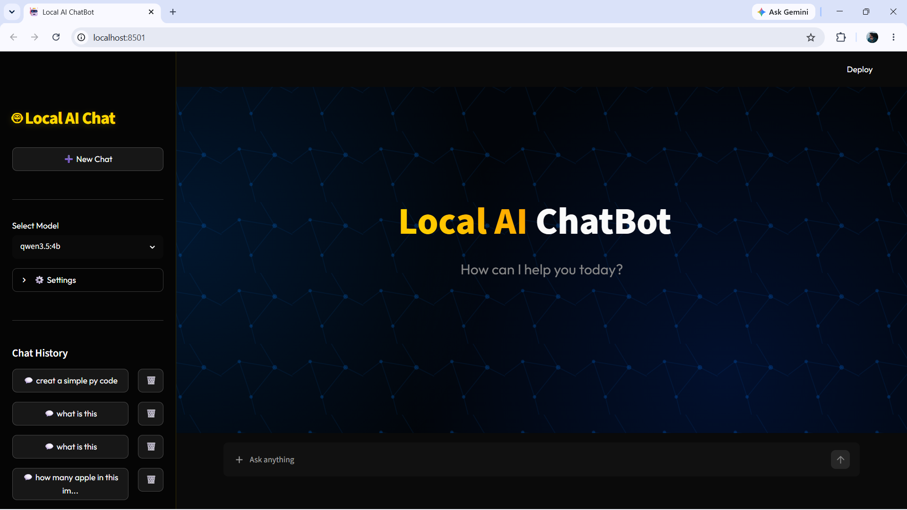
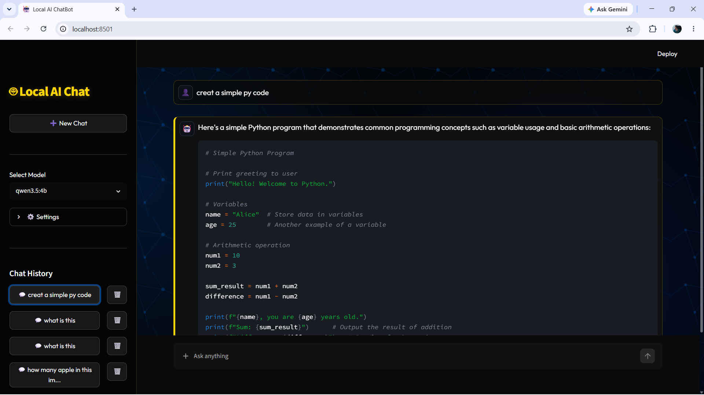
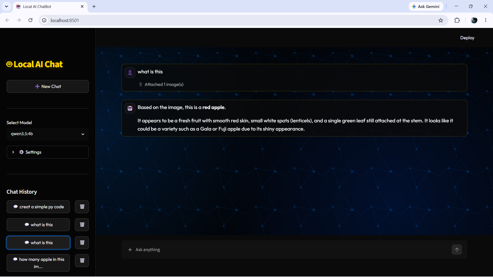

<div align="center">
  
  
  <h1>🤖 Local LLM-Based Multimodal AI Chatbot</h1>

  <p>
    <strong>A fully offline, privacy-first AI chatbot with multimodal document & image understanding — powered by Ollama & Streamlit.</strong>
  </p>

  <p>
    <a href="https://python.org/"></a>
    <a href="https://streamlit.io/"></a>
    <a href="https://ollama.ai/"></a>
    <a href="LICENSE"></a>
    <br>
    
  </p>
</div>

<hr />

## 📑 Table of Contents

- [📖 Overview](#-overview)
- [✨ Key Features](#-key-features)
- [📸 Screenshots](#-screenshots)
- [🗂️ Project Architecture](#-project-architecture)
- [🚀 Getting Started](#-getting-started)
  - [Prerequisites](#prerequisites)
  - [Installation](#installation)
  - [Running the App](#running-the-app)
- [🧑‍💻 How to Use](#-how-to-use)
- [🌐 Supported Formats](#-supported-formats)
- [🛡️ Privacy & Security](#️-privacy--security)
- [🤝 Contributing](#-contributing)
- [📄 License](#-license)

---

## 📖 Overview

**Local LLM-Based Multimodal AI Chatbot** is a production-grade, locally-hosted conversational interface that brings the power of ChatGPT directly to your machine. Built on top of **Streamlit** and **Ollama**, this application ensures zero data leakage by processing everything locally.

It goes beyond basic text generation by supporting **multimodal interactions**. You can upload documents (PDF, DOCX, CSV, MD) or images (PNG, JPG), and the AI will analyze them contextually — all without requiring an internet connection.

---

## ✨ Key Features

| Feature | Description |
| :--- | :--- |
| 🔒 **100% Local & Private** | Zero cloud dependencies. Your data never leaves your machine. |
| 🧠 **Multimodal Support** | Chat with PDFs, Word Docs, text files, and images natively. |
| 💬 **Real-Time Streaming** | Experience seamless, token-by-token generation for a fluid UX. |
| 🗂️ **Session Management** | Save, load, rename, and delete chat sessions automatically. |
| 🔄 **Dynamic Model Switching** | Detects installed Ollama models and lets you swap instantly. |
| ⚙️ **Fine-Tuned Control** | Adjust `Temperature` and `Max Tokens` on the fly via the sidebar. |
| 🚀 **Smart Auto-Start** | Automatically boots up the Ollama background service if offline. |
| 🎨 **Premium UI/UX** | Dark theme, gradient accents, smooth transitions, and markdown support. |

---

## 📸 Screenshots

> _Experience a clean, modern interface designed for focus and productivity._

<div align="center">
  
  <p><em>Modern, clean, dark-themed chat interface</em></p>
</div>

<br>

<div align="center">
  
  <p><em>Streaming responses with advanced syntax highlighting</em></p>
</div>

<br>

<div align="center">
  
  <p><em>Multimodal vision capabilities with direct image uploads</em></p>
</div>

---

## 🗂️ Project Architecture

A modular, highly maintainable Python codebase.

```text
Local LLM-Based Multimodal AI Chatbot/
│
├── app.py                  # 🚀 Main Streamlit Application Entry Point
├── config.py               # ⚙️  Global Constants & Configurations
├── requirements.txt        # 📦 Dependency Manifest
├── run.bat                 # 🖱️  One-click Executable for Windows
│
├── services/               # Core Logic & API Integrations
│   ├── ollama.py           # 🧠 Ollama backend handler (streaming, models)
│   └── chat.py             # 💾 Local JSON state persistence
│
├── ui/                     # User Interface Components
│   ├── sidebar.py          # 🗃️  Navigation, Settings, & Chat History
│   └── chat_interface.py   # 💬 Message window, Input field, File handling
│
├── utils/                  # Helper Utilities
│   ├── file_parser.py      # 📄 Document text extraction engine
│   └── helpers.py          # 🔧 Assorted utility scripts
│
├── styles/                 # Styling Assets
│   └── main.css            # 🎨 Custom CSS for the Premium Dark UI
│
└── chats/                  # 📁 Auto-generated local database for conversations
```

---

## 🚀 Getting Started

Follow these steps to deploy the AI on your local workstation.

### Prerequisites

1. **Python 3.8+** — [Download here](https://www.python.org/downloads/)
2. **Ollama** — [Download here](https://ollama.com/download)
3. **LLM Models** — Pull at least one model via your terminal:

```bash
# Recommended for standard chat (Fast & Smart)
ollama pull llama3

# Recommended for image understanding (Multimodal)
ollama pull llava
```

### Installation

Clone the repository and install the required dependencies:

```bash
# 1. Clone the repo
git clone https://github.com/your-username/Local-LLM-Based-Multimodal-AI-Chatbot.git

# 2. Navigate into the directory
cd Local-LLM-Based-Multimodal-AI-Chatbot

# 3. Install dependencies
pip install -r requirements.txt
```

### Running the App

**For Windows Users:**
Simply double-click the `run.bat` file.

**For All Platforms (Terminal):**
Execute the following command in the project root:

```bash
streamlit run app.py
```

The application will launch automatically in your default browser at `http://localhost:8501`.

---

## 🧑‍💻 How to Use

1. **Select a Model:** Use the dropdown in the sidebar to choose your preferred AI model.
2. **Adjust Settings:** Open the `⚙️ Settings` expander to tweak creativity (`Temperature`) and length (`Max Tokens`).
3. **Upload Context:** Click the 📎 attachment icon in the chat input to upload documents or images.
4. **Chat:** Type your prompt and press enter. The AI will stream its response live.
5. **Manage History:** Your conversations are auto-saved. Access, switch, or delete them anytime via the sidebar.

---

## 🌐 Supported Formats

The application comes with a built-in document parser capable of handling various file types:

| Format Category | Extension(s) | Processing Method |
| :--- | :--- | :--- |
| **Documents** | `.pdf`, `.docx` | Text is extracted, cleaned, and injected into the LLM context window. |
| **Data & Text** | `.txt`, `.md`, `.csv` | Parsed directly as UTF-8 strings. |
| **Images** | `.png`, `.jpg`, `.jpeg`| Encoded as Base64 and sent directly to vision models (e.g., LLaVA). |

---

## 🛡️ Privacy & Security

In an era of data harvesting, this project is built on the foundation of absolute privacy:

- ✅ **Air-Gapped Capable:** Works entirely offline after the initial setup.
- ✅ **No Telemetry:** Zero tracking scripts or analytics.
- ✅ **Data Ownership:** All chat logs are stored strictly as local JSON files on your hard drive.
- ✅ **Private Inference:** Model execution happens on your CPU/GPU. No external API calls are made.

---

## 🤝 Contributing

We welcome contributions from the community! To contribute:

1. **Fork** the repository.
2. **Create a branch:** `git checkout -b feature/amazing-feature`
3. **Commit changes:** `git commit -m "Added an amazing feature"`
4. **Push to branch:** `git push origin feature/amazing-feature`
5. **Open a Pull Request.**

---

## 📄 License

Distributed under the **MIT License**. See `LICENSE` for more information.

<hr />

<div align="center">
  <p>Built with ❤️ for privacy-conscious developers.</p>
  <p><b>Keep your conversations local. Keep your data yours.</b></p>
</div>
